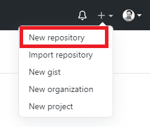
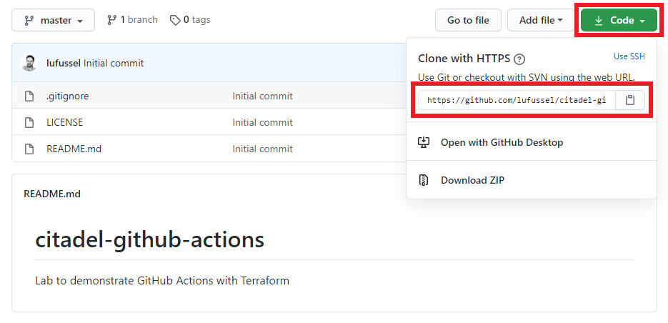
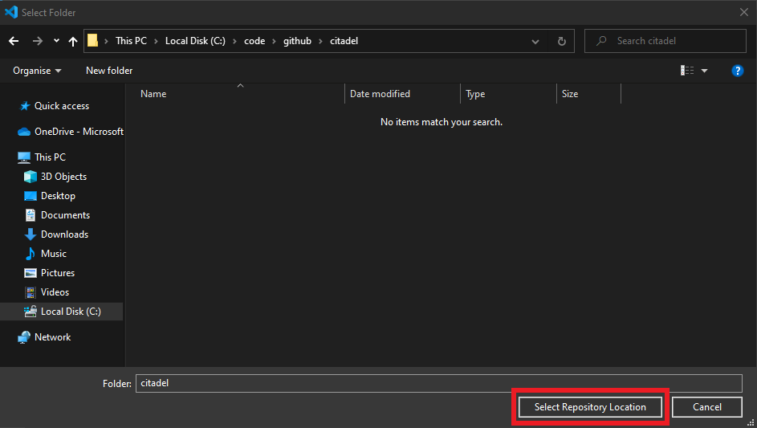
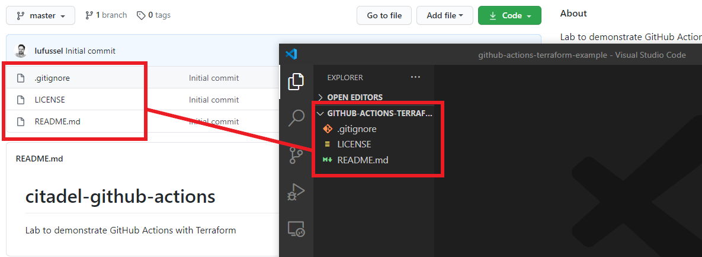
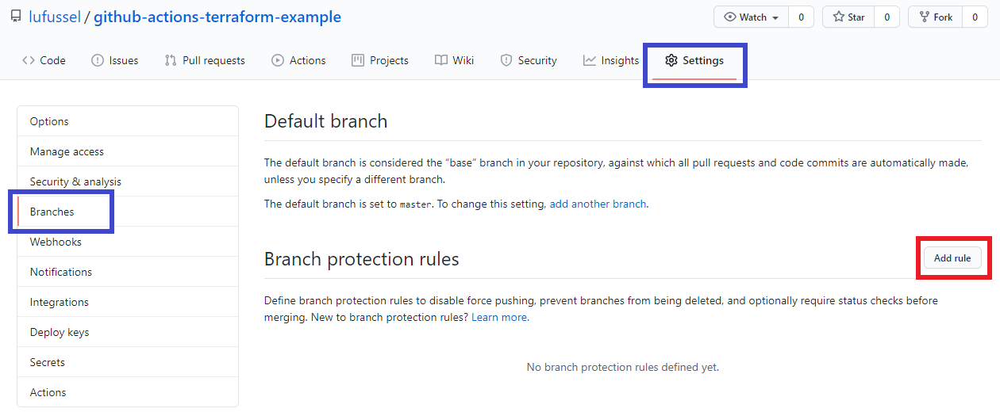
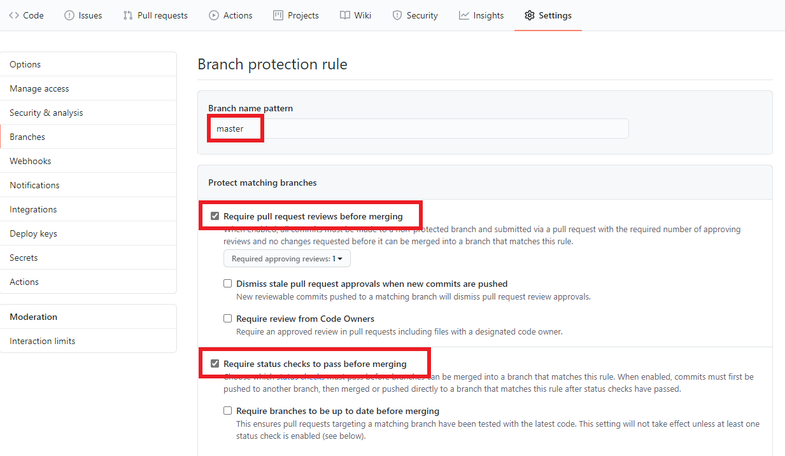
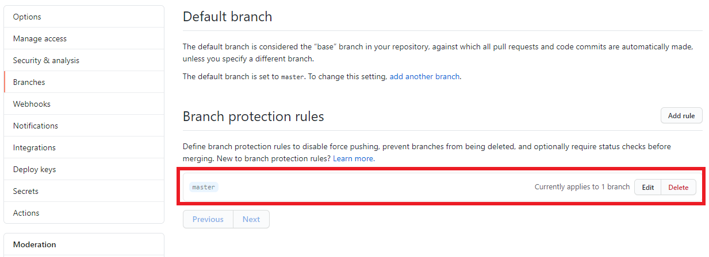

# Prepare a GitHub repository

## Introduction

Before we can get started with GitHub Actions, we will set up an example environment within GitHub to demonstrate the integration with GitHub Actions and the wider GitHub toolset.

In this lab we will create a new repository and add branch protection rules.

> Branch protection is not a requirement for GitHub Actions, but this will feed into how GitHub Actions can be utilized for testing and approval of pull requests.

### Create a new GitHub repository

1. Log in to GitHub and use the `+` menu at the top right of the page, and select **New repository**.

    

    > *Don't have a GitHub account? [GitHub Docs - Signing up for GitHub](<https://docs.github.com/en/github/getting-started-with-github/>    signing-up-for-github)*

1. Complete the form and click **Create repository**.

    - Repository template: `No template`
    - Owner: `Choose where to store the new repo`
    - Repository name: `Enter a short name for the repo`
    - Add .gitignore: `Terraform`

    

    > *Learn more at [GitHub Docs - Creating a new repository](https://docs.github.com/en/github/getting-started-with-github/create-a-repo).*

### Create a local clone of the repo

3. Browse to the new repo (GitHub should redirect automatically), click the **Code** button and use copy the URL to the Git repository.

    

1. Run `git clone` from your preferred shell (such as PowerShell or Bash) or from your IDE (such as VS Code). We'll use VS Code for this example.

    - From VS Code press `Ctrl+Shift+P` to show the Command Palette and enter `git clone`.

    

    - Enter the URL of your Git repository to Clone from URL.

    

    - VS Code will prompt for a location to store the repository in your local file system.

    

    - Open the cloned repository. VS Code will prompt this automatically after the clone completes, or use the

    

    - VS Code will now mirror the files stored within your GitHub repository.

    

### Enable branch protection

Enabling branch protection will demonstrate the use of pull request approvals and status checks using GitHub Actions.

5. From within your GitHub repository, click **Settings**, **Branches** and **Add rule**.

    

1. Set the **Branch name pattern** match to `master` (which is the name of the default branch in GitHub), and check the boxes for **Require pull request reviews before merging** and **Require status checks to pass before merging**. Click **Create** to enable the rule.

    

    

    Branch protection rules can be reviewed within **Settings**, **Branches**.

    

    > *Learn more at [GitHub Docs - Configuring protected branches](https://docs.github.com/en/github/administering-a-repository/configuring-protected-branches).*

## End of Lab 2

At the end of this lab, you should have

- A new Git repository in GitHub
- A local clone of the Git repository
- Two basic branch protection rules

Proceed to [Lab 3: Create a GitHub project board](../3-create-a-github-project-board/).
